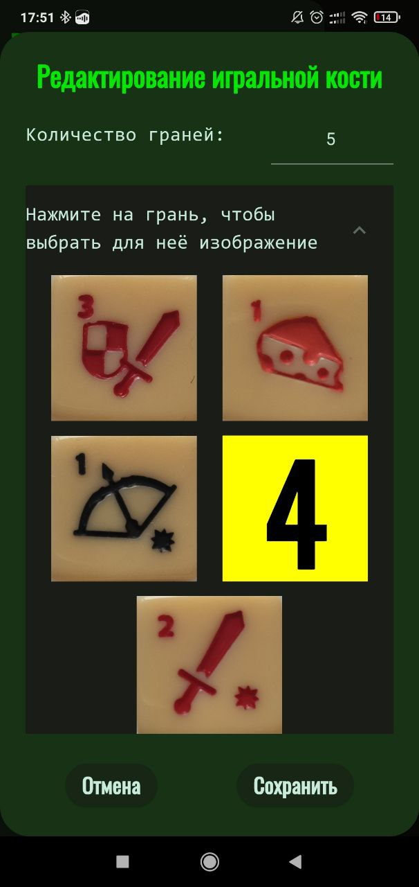
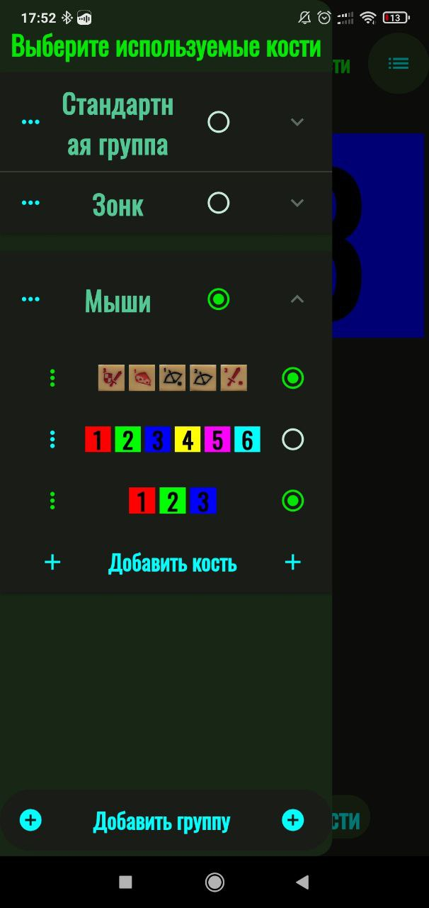
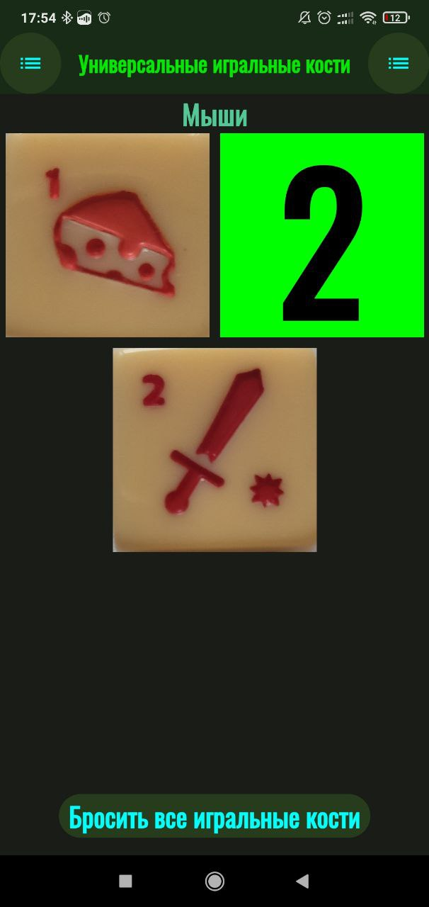

# $\mathbb{\color[RGB]{255,60,0}{Универсальные \ игральные \ кости \ (Графич, \ Androud)}}$

## $\mathbb{\color[RGB]{255,90,0}{Основная \ информация}}$

### $\mathbb{\color[RGB]{255,127,0}{Стек \ технологий \ разработки}}$

- Язык $\mathbb{\color[RGB]{252,193,83}{Dart}}$
	+ Фреймворк $\mathbb{\color[RGB]{252,193,83}{Flutter}}$.
- Тестирование
	+ $\mathbb{\color[RGB]{252,193,83}{интеграционные \ тесты}}$ через библиотеку integration_test.
	+ $\mathbb{\color[RGB]{252,193,83}{модульные \ тесты}}$ через библиотеку flutter_test.

### $\mathbb{\color[RGB]{255,127,0}{Среда \ разработки}}$

- Android Studio

### $\mathbb{\color[RGB]{255,127,0}{Фото \ работы}}$

|Создание любого собственного кубика|Выбор используемых кубиков|Бросок всех выбранных кубиков|
|-|-|-|
||||

## $\mathbb{\color[RGB]{255,90,0}{Дата}}$

&emsp;&emsp; $\mathbb{\color[RGB]{252,193,83}{Май \ 2024}}$

## $\mathbb{\color[RGB]{255,90,0}{Заключение}}$

&emsp;&emsp;Приложение полностью нормально функционирует, но немного страдает дизайн. Вы можете скачать его в [релизах](https://github.com/MyEducation11235/UniversalDice/releases/latest), что-бы всегда быть готовым к настольной игре.

${\color{yellow}TODO}$ 1) Изменить размеры кнопки бросить на повыше.\
${\color{yellow}TODO}$ 2) Боковые менюшки очень узкине на больших экранах.\
${\color{yellow}TODO}$ 3) Добавить инструкцию по использованию?
